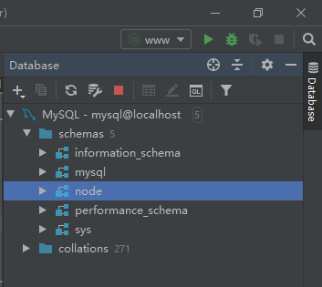
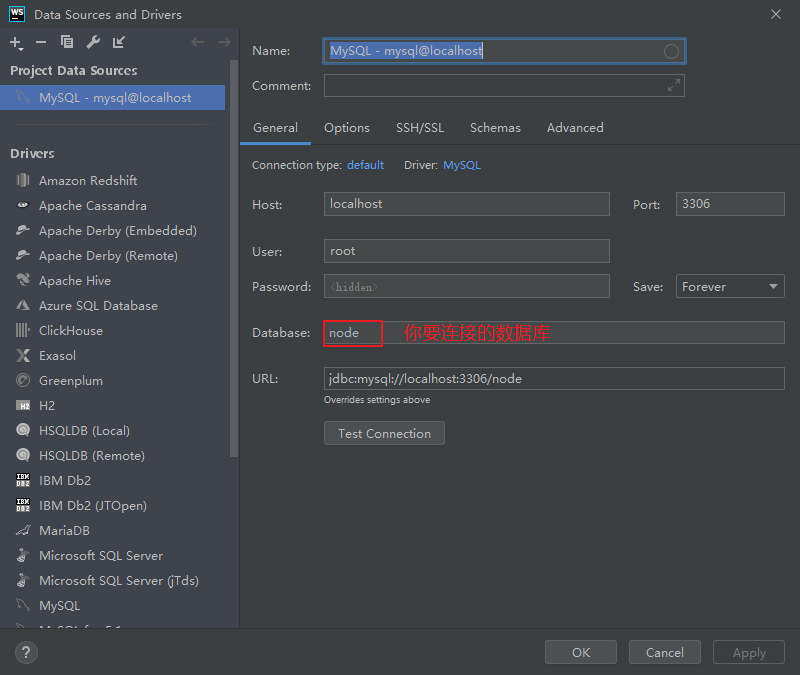
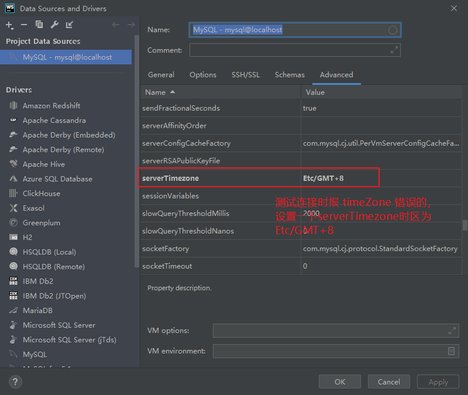

## chatroom

Node.js 聊天室，技术栈为 Node.js + express + socket.io + pug + mysql，简单的注册登录，修改密码（增删改查）。聊天可以发送表情和图片。更复杂的功能还在完善，感兴趣的可以作为学习Node.js的小demo参考一下。

### 启动步骤

#### 1. 安装MySQL数据库

这个网上有很多教程，我这里安装的是MySQL 8.0.15，仅安装了server部分。

#### 2. 安装WebStorm数据库插件

ctrl + alt + s 打开 WebStorm 的设置面板，在 Plugins 里面搜索 Marketplace，输入关键字 DB，然后安装第二个官方的操作数据库的插件，安装好后需要重启WebStorm。


安装好之后，会在WebStorm右侧出现一个DataBase插件（里面的node数据库是我新加的，刚安装是没有的）



配置一下目标数据库



设置数据库时区



更新认证方式为密码认证

如果遇到了 `Client does not support authentication protocol requested by server; consider upgrad`这个错误，需要更改一下数据库加密方式。

打开mysql窗口，执行如下命令：

```js
// 密码改成你的数据库密码
ALTER USER 'root'@'localhost'IDENTIFIED WITH mysql_native_password BY '密码'
```
//重启
```js
FLUSH PRIVILEGES
```


#### 3. 创建数据库和表

这里使用刚才装好的插件进行可视化操作，比较简单。比如我创建了一个 node 数据库，然后添加了一张用户信息表 users。


你可以创建其他的数据库和表。

#### 4. 安装依赖

npm install 


#### 5. 检查代码中数据库连接配置

检查文件DAO/db.js ，保证数据库信息与你创建的数据库信息是一致的。


#### 6. 启动

npm run start
